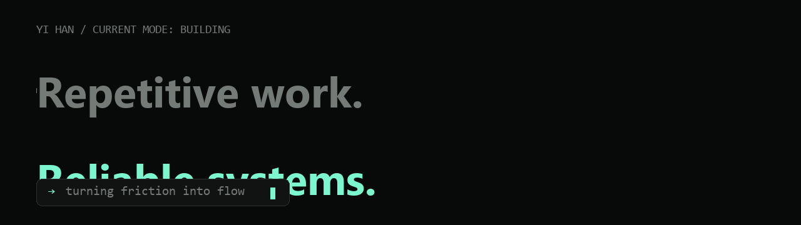

# Hey, I'm Yi Han.

A full-stack developer in Auckland building **AI-assisted products and practical automation**. I turn messy, repetitive workflows into reliable systems people can actually use.

[View my portfolio](https://hannnnnnnny.github.io/yi-han-software-engineer/) · [Connect on LinkedIn](https://www.linkedin.com/in/yi-han-29ab28323/) · [Email me](mailto:harryhaber606@gmail.com)

## Selected systems

### [01 · KiwiCue](https://github.com/hannnnnnnny/kiwicue)

Bilingual Auckland event discovery with smart reminders.

TypeScript · Product discovery · Automation

---

### [02 · PanSub](https://github.com/hannnnnnnny/pansub)

Real-time AI Chinese subtitles for lecture recordings.

JavaScript · AI integration · Accessibility

---

### [03 · Till Tally](https://github.com/hannnnnnnny/till-tally)

Retail analytics that turns sales data into useful decisions.

TypeScript · Data visualization · Business intelligence

## Working with

TypeScript · JavaScript · Java · Spring Boot · Vue · MySQL · AI integrations · Workflow automation

---

Building from Auckland, New Zealand — always interested in useful software, thoughtful automation, and the problems between them.
