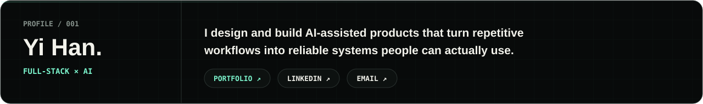
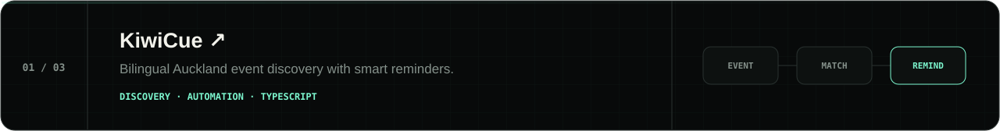
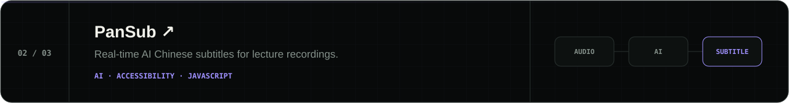
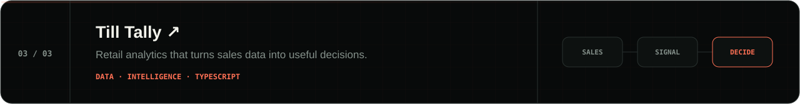
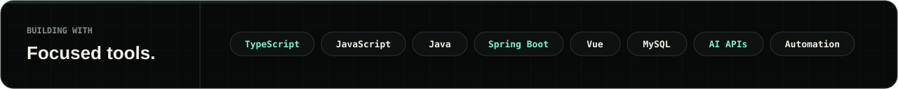
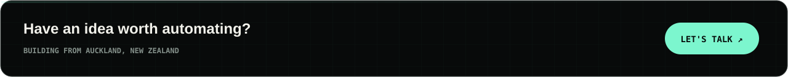

  <a href="https://hannnnnnnny.github.io/yi-han-software-engineer/">Portfolio</a>
  &nbsp;·&nbsp;
  <a href="https://www.linkedin.com/in/yi-han-29ab28323/">LinkedIn</a>
  &nbsp;·&nbsp;
  <a href="mailto:harryhaber606@gmail.com">Email</a>

